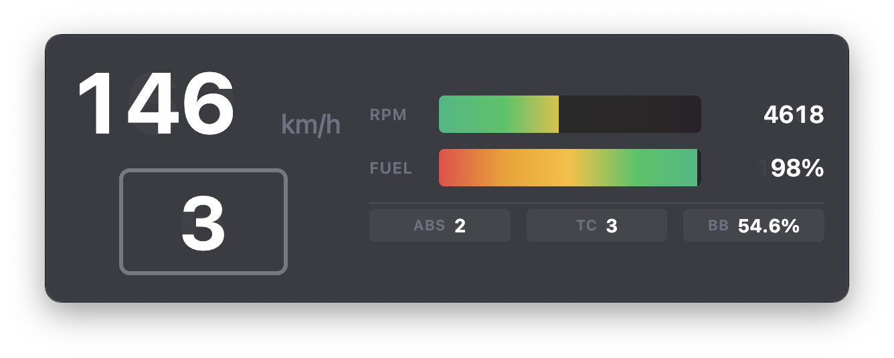
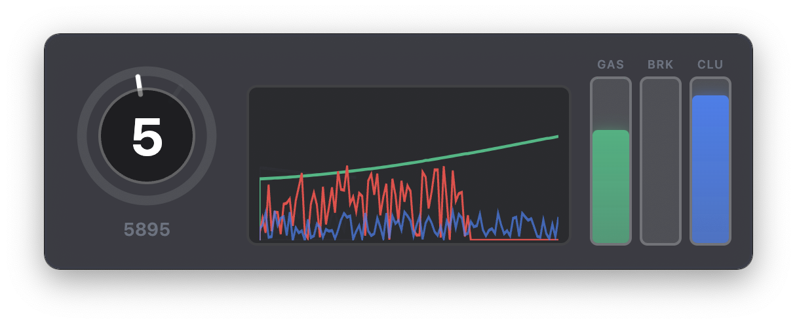
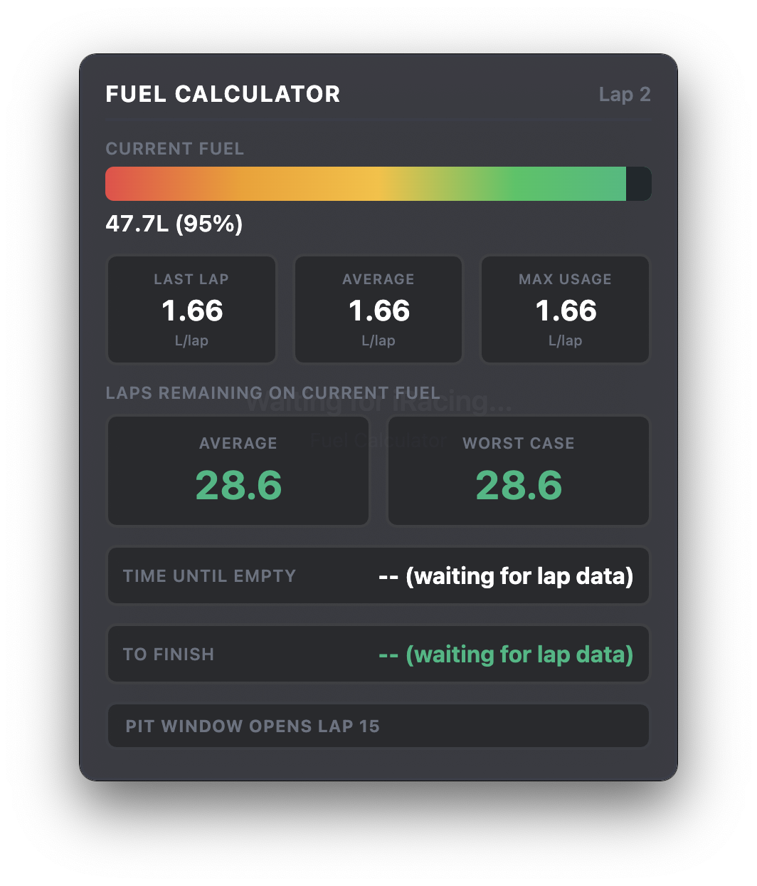
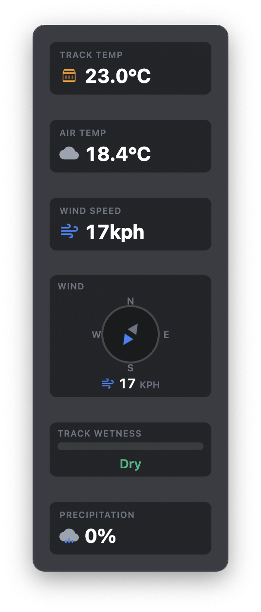
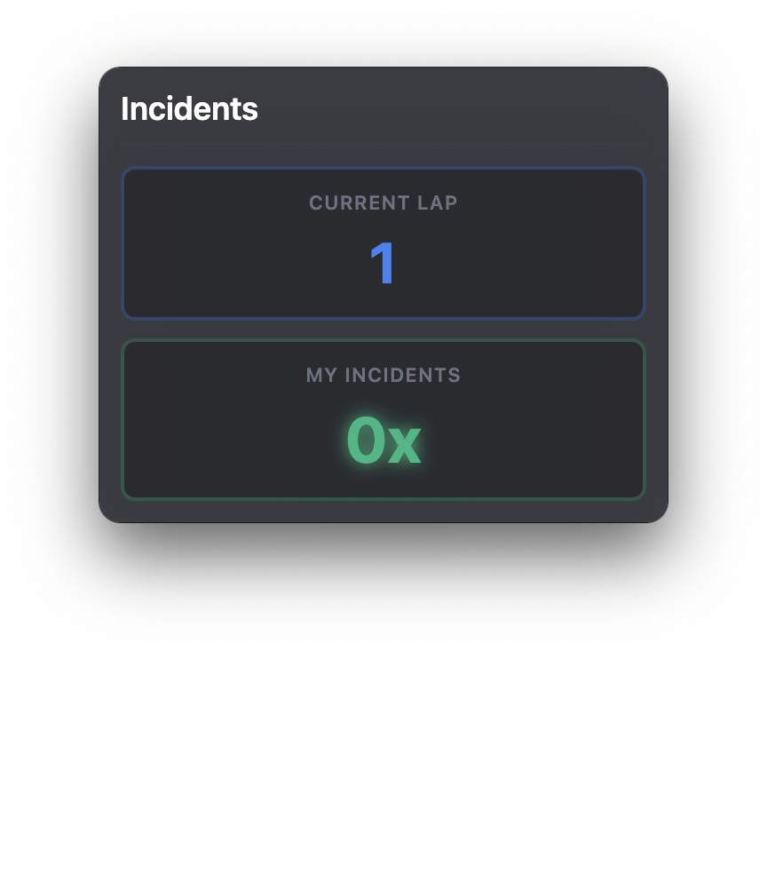
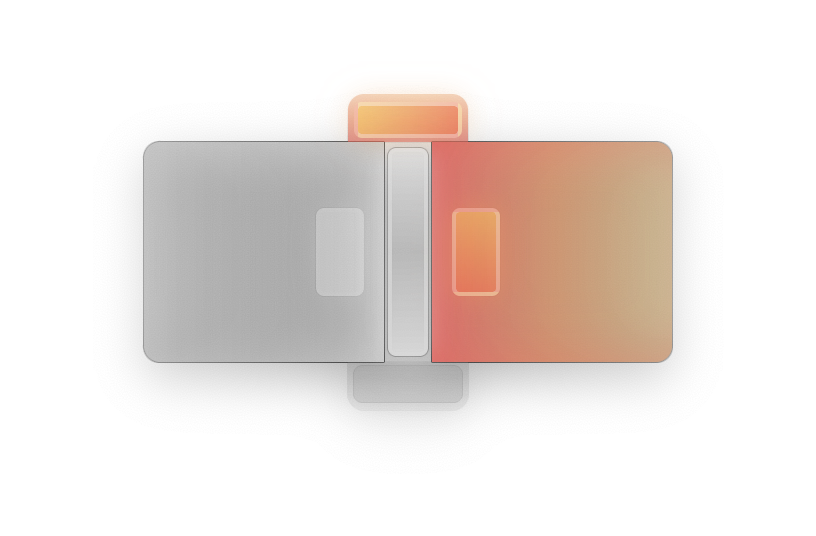
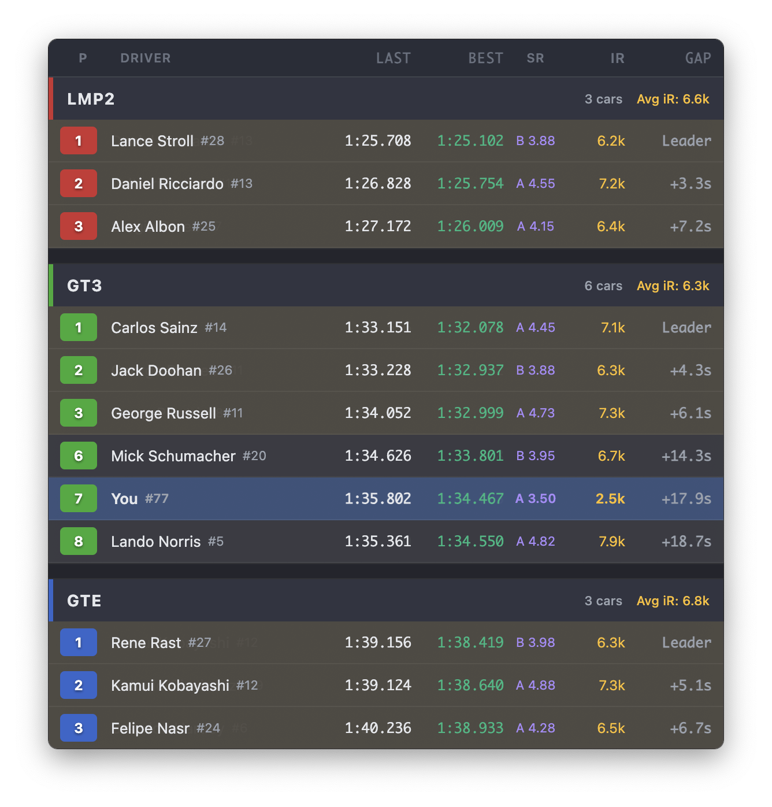
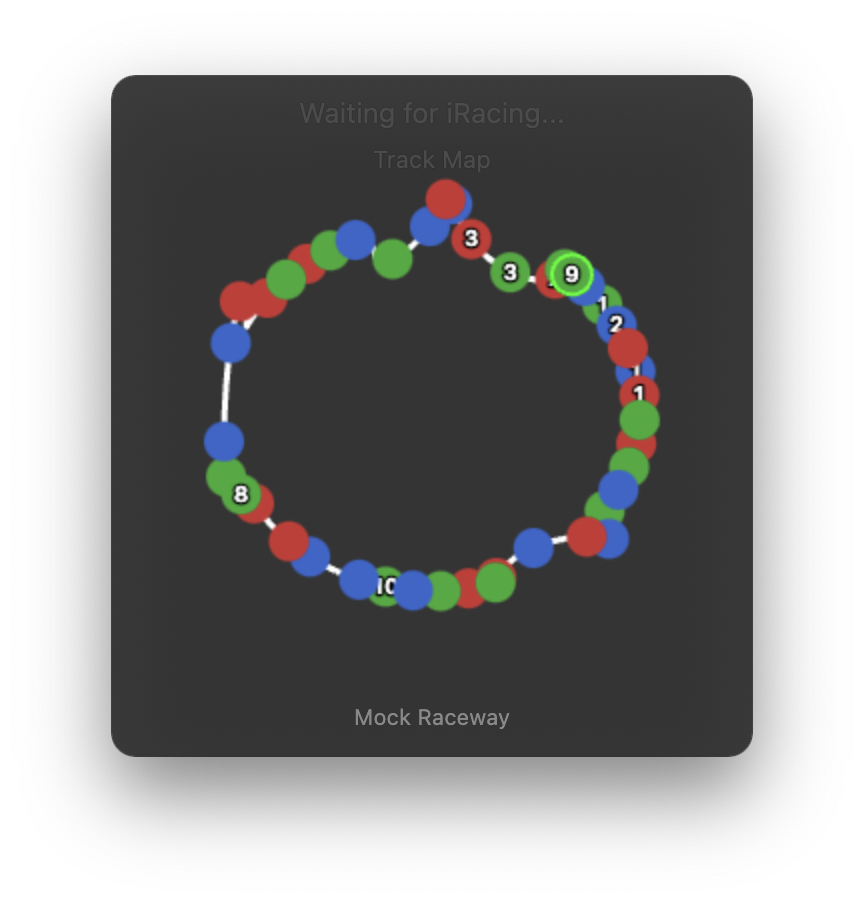

# Edge Overlays

Professional transparent telemetry overlays for iRacing. Monitor your car's performance in real-time with customizable, always-on-top displays. Now with **SteamVR support** for immersive VR racing!

## Discord
[Discord](https://discord.gg/grUK2yj7Dw)

## Overlay Previews

<table>
  <tr>
    <td width="50%">
      <h3>Telemetry Overlay</h3>
      
      
Real-time speed, RPM, gear, and fuel monitoring with gradient bars

    </td>
    <td width="50%">
      <h3>Input Overlay</h3>
      
      
Visualize steering, throttle, brake, and clutch inputs with history graph

    </td>
  </tr>
  <tr>
    <td width="50%">
      <h3>Relative Overlay</h3>
      
      
Monitor gap times to cars ahead and behind with driver info, iRating, and safety rating

    </td>
    <td width="50%">
      <h3>Fuel Calculator</h3>
      
      
Fuel consumption, laps remaining, time until empty, and pit strategy calculator

    </td>
  </tr>
  <tr>
    <td width="50%">
      <h3>Weather Overlay</h3>
      
      
Track conditions, temperature, wind, and precipitation data

    </td>
    <td width="50%">
      <h3>Incidents Overlay</h3>
      
      
Track your incident count and team incidents in team races

    </td>
  </tr>
  <tr>
    <td width="50%">
      <h3>Radar Overlay</h3>
      
      
Track nearby cars with position-aware radar display

    </td>
    <td width="50%">
      <h3>Leaderboard Overlay</h3>
      
      
Live standings with positions, gap times, iRating, and class filtering

    </td>
  </tr>
  <tr>
    <td width="50%">
      <h3>Track Map Overlay</h3>
      
      
Visual track map with car positions and corner numbers

    </td>
    <td width="50%">
      <h3>Overtake Overlay</h3>
      
Proximity alerts for passing opportunities with driver info

    </td>
  </tr>
</table>

## Features

### Overlay Types

- **Telemetry Overlay** - Real-time speed, RPM, gear, and fuel monitoring
- **Input Overlay** - Visualize steering, throttle, brake, and clutch inputs with configurable history graph
- **Radar Overlay** - Track nearby cars with position-aware radar (auto-hides when Overtake is active)
- **Relative Overlay** - Gap times, iRating, safety rating, rolling average lap times, flag badges
- **Fuel Overlay** - Fuel consumption, laps remaining, time until empty, pit strategy, team fuel sharing
- **Weather Overlay** - Track conditions, temperature, wind, precipitation, track wetness
- **Leaderboard Overlay** - Live standings with class filtering, manufacturer column, iRating/SR
- **Track Map Overlay** - Dynamic track layout with car positions and corner numbers
- **Overtake Overlay** - Proximity alerts for close racing situations
- **Incidents Overlay** - Session and team incident tracking
- **Flags Overlay** - Display current racing flags
- **Webview Overlay** - Embed external URLs (Twitch chat, Discord, etc.)

### SteamVR Support (New in v0.13.0!)

Display overlays directly in your VR headset using the native VR Companion app:

- **World-Space Overlays** - Fixed position panels in your cockpit view
- **8 VR Overlay Types** - Telemetry, Input, Relative, Fuel, Weather, Leaderboard, Incidents, Overtake
- **VR Positioning Mode** - F9 to toggle, WASD/QE to move, RF to resize, Tab to select
- **Recenter System** - Press End (or gamepad button) to recenter all overlays to your head position
- **Per-Car Positions** - Overlay positions saved separately for each car you drive
- **VR Only Mode** - Hide desktop windows to save system resources
- **Hide in Garage/On Track** - Per-overlay visibility options

### Team Fuel Sharing

Share real-time fuel data with teammates using P2P WebRTC:
- Direct peer-to-peer connections (no server required)
- Share fuel levels, consumption rates, and stint data
- Team average fuel calculations for coordinated strategy
- Works even when spectating teammates

### Core Features

- **Always-On-Top** - Overlays stay visible while racing in borderless window mode
- **Click-Through Mode** - Lock overlays for gaming, unlock to reposition
- **Real-Time Data** - Direct integration with iRacing SDK at 60 Hz (30 Hz to UI)
- **Modern Design** - Clean, professional interface with smooth animations
- **Unit Flexibility** - Switch between metric (km/h, L) and imperial (mph, gal)
- **Smart Persistence** - All positions and settings saved automatically
- **Auto-Updates** - Built-in update checker with one-click installation
- **Performance** - Minimal CPU/GPU impact during races
- **System Tray** - Minimize to tray, quick toggle overlays
- **Multi-Monitor Support** - Position overlays on any monitor with saved positions
- **Taskbar Integration** - Optionally show overlay windows in the taskbar
- **Light/Dark Themes** - Choose your preferred appearance

### Browser & Streaming

- **Browser Access** - Access overlays from any web browser at `http://localhost:8855`
- **OBS Integration** - Add overlays to your stream via browser source
- **Remote Access** - Use a tablet or phone as an external dashboard
- **Available URLs**:
  - `/telemetry` - Speed, RPM, gear, fuel
  - `/fuel` - Fuel strategy and calculations
  - `/relative` - Gap times to nearby drivers
  - `/input` - Steering, throttle, brake visualization
  - `/weather` - Track and air conditions
  - `/incidents` - Incident count tracking
  - `/leaderboard` - Race positions
  - `/trackmap` - Track position visualization
  - `/radar` - Nearby car radar
  - `/overtake` - Proximity alerts

### MQTT Integration

- **Local MQTT Broker** - Built-in Aedes broker for local telemetry streaming
- **External MQTT** - Connect to external brokers for home automation integration
- **Topic Structure** - Organized telemetry data for easy consumption

## Download

**[Download Latest Release](https://github.com/robedge/edge-overlays-releases/releases/latest)**

### System Requirements

| Requirement | Specification |
|------------|---------------|
| OS | Windows 10/11 (64-bit) |
| iRacing | Active subscription |
| Display Mode | Borderless Window* |
| VR (optional) | SteamVR compatible headset |

\* **Important**: iRacing must run in Borderless Window mode for desktop overlays to appear on top

## Installation

1. Download `Edge.Overlays.Setup.{version}.exe` from [releases](https://github.com/robedge/edge-overlays-releases/releases/latest)
2. Run the installer
3. Follow the installation wizard
4. Launch **Edge Overlays** from Start Menu or desktop shortcut

## Quick Start Guide

### Desktop Overlays

1. **Launch the App** - Start Edge Overlays before or during your iRacing session
2. **Configure iRacing**
   - Go to iRacing Graphics Settings
   - Set **Display Mode** to **Borderless Window**
   - Apply and restart iRacing if needed
3. **Add Overlays**
   - Click `+ Telemetry`, `+ Inputs`, or other overlay buttons
   - Multiple overlays can be active simultaneously
4. **Position Overlays**
   - Click `Unlocked` to enable dragging
   - Drag overlays to your preferred positions
   - Positions save automatically
5. **Lock for Racing**
   - Click `Locked` to enable click-through mode
   - Overlays become transparent to mouse clicks
6. **Race!** - Overlays automatically connect when you enter a session

### VR Overlays

1. **Start SteamVR** - Ensure your headset is connected and SteamVR is running
2. **Enable VR** - In the Control Panel, expand "VR" and toggle "Enable VR Overlays"
3. **Add Overlays** - Click overlay buttons - they appear both on desktop and in VR
4. **Position in VR**:
   - Press **F9** to enter/exit config mode
   - Use **Tab** to cycle through overlays (green border = selected)
   - **WASD** - Move left/right/forward/back
   - **Q/E** - Move up/down
   - **R/F** - Increase/decrease size
   - **Z/X** - Rotate left/right
   - **C/V** - Tilt up/down
   - Press **F10** to save positions
5. **Recenter** - Press **End** (or configured keybind) to recenter all overlays
6. **VR Only Mode** - Enable to hide desktop windows and save resources

### Control Panel

The control panel provides:

- **Connection Status** - Green when connected to iRacing, gray when waiting
- **Live Telemetry Preview** - See current speed, RPM, gear, and fuel
- **Overlay Management** - Add, remove, and toggle overlay visibility
- **Settings**
  - **Overlay Lock** - Toggle click-through mode
  - **Units** - Choose metric or imperial measurements
  - **Theme** - Light or dark mode
  - **Updates** - Check for new versions
  - **Show in Taskbar** - Display overlay windows in the system taskbar
  - **Browser Access** - Enable HTTP server for browser/OBS access
  - **Port** - Configurable port (default: 8855)
  - **Remote Access** - Allow connections from other devices on your network
  - **Reset Positions** - Reset all overlay positions to defaults

### System Tray

Edge Overlays lives in your system tray:

- **Left-click** (Windows/Linux) - Toggle control panel visibility
- **Right-click** - Access menu
  - Show/Hide Control Panel
  - Toggle All Overlays
  - Quit Application

## Configuration

### Unit Preferences

| Setting | Metric | Imperial |
|---------|--------|----------|
| Speed | km/h | mph |
| Fuel | Liters | Gallons |

### Overlay States

| Lock State | Behavior |
|------------|----------|
| Locked | Click-through enabled - perfect for racing |
| Unlocked | Draggable - reposition as needed |

### Per-Overlay Settings

- **Hide in Garage** - Auto-hide when locked and in garage
- **Hide on Track** - Auto-hide when on track (useful for garage-only overlays)

All settings persist across sessions and app restarts.

## Troubleshooting

### Overlays Not Appearing

1. Ensure iRacing is running in **Borderless Window** mode
2. Verify you're in an active session (not main menu)
3. Check Edge Overlays shows "Connected" status
4. Try toggling overlay visibility with the toggle switch
5. Unlock overlays and check if they're off-screen

### VR Overlays Not Showing

1. Ensure SteamVR is running and headset is active
2. Toggle "Enable VR Overlays" off and on
3. Check if VR Companion shows "Connected" in control panel
4. Try recentering overlays with the End key

### Connection Issues

- Wait for the session to fully load before expecting telemetry
- Restart Edge Overlays if connection issues persist
- Ensure iRacing is actually running (not just Launcher)
- Check Windows Event Viewer for any related errors

### Performance Optimization

Edge Overlays is optimized for minimal impact:

- Uses native iRacing SDK integration (no polling)
- Hardware-accelerated rendering via Chromium
- Efficient 30 Hz update rate (lower than iRacing's 60 Hz)
- VR Only mode skips desktop rendering to save resources
- Low memory footprint (~50-100 MB total)

If you experience performance issues:
1. Close unused overlays
2. Enable VR Only mode when using VR
3. Reduce number of active overlays
4. Check Task Manager for other background processes

## Updates

Edge Overlays includes automatic update checking:

1. Open Settings in the control panel
2. Click **Check for Updates**
3. If available, click **Download**
4. Progress shown in control panel title bar
5. Choose **Restart Now** or **Later** when download completes

Updates are delivered securely through GitHub Releases.

## FAQ

**Q: Does this work with other racing simulators?**
A: No, Edge Overlays is designed specifically for iRacing using the official SDK.

**Q: Will this affect my iRacing performance or FPS?**
A: No, Edge Overlays uses the official SDK with minimal CPU/GPU impact.

**Q: Can I use this in VR?**
A: Yes! As of v0.13.0, Edge Overlays includes full SteamVR support with native VR overlays.

**Q: Is this allowed by iRacing?**
A: Yes, Edge Overlays uses the official iRacing SDK and doesn't modify any game files or provide unfair advantages.

**Q: How do I uninstall?**
A: Windows Settings > Apps > Edge Overlays > Uninstall

**Q: Can I customize the overlay appearance?**
A: You can choose light or dark theme. Column order is configurable for Relative and Leaderboard overlays.

**Q: Does this support multi-monitor setups?**
A: Yes, overlays can be positioned on any monitor. Positions are saved per-monitor.

**Q: Can I use this with OBS for streaming?**
A: Yes! Enable Browser Access in settings, then add a browser source in OBS pointing to `http://localhost:8855/telemetry` (or any other overlay URL).

**Q: Can I view overlays on a tablet or phone?**
A: Yes, enable Remote Access in settings, then access `http://<your-pc-ip>:8855/` from any device on your network.

**Q: How does team fuel sharing work?**
A: Enable P2P fuel sharing in the Sharing tab. Enter a shared room code with your teammates to see each other's fuel data and team averages.

## License

MIT License - see [LICENSE](LICENSE) file for details

## Support & Issues

Having problems or want to request a feature?

- [Open an Issue](https://github.com/robedge/edge-overlays-releases/issues/new)
- Check [existing issues](https://github.com/robedge/edge-overlays-releases/issues)

When reporting issues, please include:
- Windows version
- iRacing version
- Edge Overlays version
- Steps to reproduce
- Screenshots if applicable

## Changelog

See [Releases](https://github.com/robedge/edge-overlays-releases/releases) for detailed version history.

### Latest Release - v0.13.3

- **League Config Editor** - Visual editor for custom class assignments in league races
  - Create custom tiers (PRO, AM, Rookie) with colors and relative speed
  - Default class mapping - unassigned drivers fall back to class defaults
  - Drag-and-drop driver assignment by car number
- **Previous Stint Laps Column (PREV)** - Track laps completed in each driver's previous stint before their last pit stop
- **Last Pitted Lap Column (PITTED)** - See the exact lap when each driver made their pit stop
- New columns available in both desktop and VR leaderboard overlays
- All columns enabled by default and fully customizable

### v0.13.1

- **DigiFlag LED Display** - New 8x8 LED matrix flag display inspired by iFLAG hardware
- LED patterns for blue, yellow, black, meatball, furled, and debris flags
- Blinking animations for yellow and black flags
- Realistic LED glow effects

### v0.13.0

- **SteamVR Support** - Native VR overlays with world-space positioning
- **VR Config Mode** - F9 to position overlays with WASD/QE/RF controls
- **VR Recenter** - End key (or gamepad) recenters all overlays to HMD
- **Per-Car VR Positions** - Overlay positions saved per car
- **Team Fuel Sharing** - P2P WebRTC fuel data sharing with teammates
- **Rolling Avg Lap Time** - AVG(5) column in Relative overlay
- **Time Until Empty** - Fuel overlay shows estimated time remaining
- **Safety Rating Badges** - Colored SR badges in Relative/Leaderboard
- **Manufacturer Column** - Leaderboard shows car brand
- **Overtake Overlay** - Proximity alerts for passing opportunities
- **Flags Overlay** - Display current racing flags
- **Column Reordering** - Configure Relative/Leaderboard column order
- Many bug fixes and performance improvements

## Acknowledgments

- Built with the official [iRacing SDK](http://www.iracing.com/)
- VR support via [OpenVR](https://github.com/ValveSoftware/openvr)
- Powered by [Electron](https://www.electronjs.org/), [Svelte](https://svelte.dev/), and [TypeScript](https://www.typescriptlang.org/)
- Icons and UI inspired by modern racing telemetry systems

---

**Built with care for the iRacing community**

[Download Latest Release](https://github.com/robedge/edge-overlays-releases/releases/latest) | [View All Releases](https://github.com/robedge/edge-overlays-releases/releases) | [Report Issue](https://github.com/robedge/edge-overlays-releases/issues/new)
